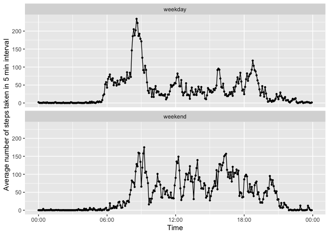

## Loading and preprocessing the data

It is now possible to collect a large amount of data about personal movement using activity monitoring devices such as a Fitbit, Nike Fuelband, or Jawbone Up. This assignment makes use of data from a personal activity monitoring device, which collects data at 5 minute intervals through out the day. The data consists of two months of data from an anonymous individual collected during the months of October and November, 2012 and include the number of steps taken in 5 minute intervals each day.

The variables included in this dataset are:

* **steps**: Number of steps taking in a 5-minute interval (missing values are coded as NA)
* **date** : The date on which the measurement was taken in YYYY-MM-DD format
* **interval** : Identifier for the 5-minute interval in which measurement was taken

The dataset is stored in a comma-separated-value (CSV) file and there are a total of 17,568 observations in this dataset.


```r
library(readr)
library(stringr)

# Load the data from a csv file 
activity <- read_csv("activity.csv", col_types = cols(date = col_character(), 
                                                      interval = col_character(), 
                                                      steps = col_number()))
# Process/transform the data : normalize intervals with adding zero(s) in front
for (i in 1:nrow(activity)) {
    if (str_length(activity[i, 3]) ==1) {
        activity[i,3] <- str_c("000", activity[i,3], sep="")
    } else if (str_length(activity[i,3]) == 2) {
        activity[i,3] <- str_c("00", activity[i,3], sep="")
    } else if (str_length(activity[i,3]) ==3) {
        activity[i,3] <- str_c("0", activity[i,3], sep="")
    }
}
# insert a colon to explicitly represent "time"
activity$interval = str_c(str_sub(activity$interval, start=1, end=2), ":", 
                          str_sub(activity$interval, start=3, end=4))
activity_norm <- as.data.frame(na.omit(activity))
print(activity_norm[1:5,], row.names=FALSE)
```

```
 steps       date interval
     0 2012-10-02    00:00
     0 2012-10-02    00:05
     0 2012-10-02    00:10
     0 2012-10-02    00:15
     0 2012-10-02    00:20
```

## What is mean total number of steps taken per day?

With normalized data, the total number of steps taken per day is calculated and visualized as follows.

```r
library(ggplot2)

# Calculate the total number of steps taken per day
daily_steps <- aggregate(activity_norm$steps, by=list(date=activity_norm$date), FUN=sum)
colnames(daily_steps) <- c("date", "steps")
daily_steps$date <- as.Date(daily_steps$date, format="%Y-%m-%d")

# Make a daily information about the total number of steps taken each day
g <- ggplot(daily_steps, aes(x=date, y=steps, width=0.85))
g <- g + geom_bar(stat="identity")
g <- g + xlab("Date") + ylab("Total number of steps taken each day")
plot(g)
```

<!-- -->

```r
# Make a histogram of the total number of steps taken each day
g <- ggplot(daily_steps, aes(x=steps)) 
g <- g + geom_histogram(binwidth=1000)
g <- g + xlab("Total number of steps taken each day")
plot(g)
```

<!-- -->

The mean and median of the total number of steps taken per day can be obtained as follows.

```r
options(scipen = 100)
mean_steps <- mean(daily_steps$steps)
median_steps <- median(daily_steps$steps)
```
The mean of the total number of steps taken per day is 10766.1886792, and the median is 10765.

## What is the average daily activity pattern?

To understand the daily acitivity pattern, a time series plot of the 5-minute interval (x-axis) and the average number of steps taken, which are averaged across all days (y-axis), is made as follows.

```r
activity_pattern <- aggregate(activity_norm$steps, by=list(date=activity_norm$interval), FUN=mean)
colnames(activity_pattern) <- c("time","steps")
activity_pattern$time <- as.POSIXct(activity_pattern$time, format="%H:%M")

# Make a time series plot of the 5-minute interval (x-axis) and the average number of steps taken, 
# averaged across all days (y-axis)

g <- ggplot(activity_pattern, aes(x=time, y=steps))
g <- g + geom_line() + scale_x_datetime(date_labels = "%H:%M")
g <- g + geom_point(size=0.8)
g <- g + xlab("Time") + ylab("Average number of steps taken in 5 min interval")
plot(g)
```

<!-- -->

Then, we can identify the most active 5-minutes interval on average across all the days in the dataset.

```r
max_interval <- subset(activity_pattern, steps==max(activity_pattern$steps))
max_interval$time <-strftime(max_interval[1,1], format="%H:%M")
print(max_interval, row.names=FALSE)
```

```
  time    steps
 08:35 206.1698
```

The maximum number of steps is observed at 08:35, and the number of steps is 206.

## Imputing missing values

In the original data, there are a number of days/intervals where there are missing values (coded as 
NA). The presence of missing days may introduce bias into some calculations or summaries of the data.
To asess its impact, we impute missing values and calculate the mean and median of total number of steps taken per day to compare to the ones that we already obtained.


```r
# Calculate and report the total number of missing values in the dataset, i.e. the total number of rows with NAs.

na_rows = activity[!complete.cases(activity),]
nrow(na_rows)
```

```
[1] 2304
```
This can be also double-checked by summarizing the 'activity' table as follows.

```r
summary(activity)
```

```
     steps            date             interval        
 Min.   :  0.00   Length:17568       Length:17568      
 1st Qu.:  0.00   Class :character   Class :character  
 Median :  0.00   Mode  :character   Mode  :character  
 Mean   : 37.38                                        
 3rd Qu.: 12.00                                        
 Max.   :806.00                                        
 NA's   :2304                                          
```
To impute data, at fist, we need to understand how NAs are distributed in a table.

```r
na_rows$steps = 1
na_daily <- aggregate(na_rows$steps, by=list(date=na_rows$date), FUN=sum)
colnames(na_daily) <- c("date", "count")
na_daily$date <- as.Date(na_daily$date, format="%Y-%m-%d")
print(na_daily, row.names=FALSE)
```

```
       date count
 2012-10-01   288
 2012-10-08   288
 2012-11-01   288
 2012-11-04   288
 2012-11-09   288
 2012-11-10   288
 2012-11-14   288
 2012-11-30   288
```
As total number of samples by 5 min-interval is 288, this implies that data for 8 whole days shown in a table are missing, and NA does not spread to other days.
This makes the strategy for imputing very simple.  We just use the mean of 5-min interval data, which is calculated from all days, and apply for those 8 days.

```r
# Create a new dataset that is equal to the original dataset but with the missing data filled in.
imputed_activity <- activity
imputed_data <- as.integer(activity_pattern$steps)

# Apply it to columns for missing days.
origin <- as.Date(as.character(imputed_activity[1,2]), format="%Y-%m-%d")
for (i in 1:nrow(na_daily)) {
    na_date = na_daily[i,1]
    start_row = as.integer(na_date - origin) * 288 + 1
    imputed_activity[start_row:(start_row+287),1] <- imputed_data
}
```
Then, make a histogram of the total number of steps taken each day and calculate and report the mean
and median total number of steps taken per day. 

```r
imputed_daily_steps <- aggregate(imputed_activity$steps, by=list(date=imputed_activity$date), FUN=sum)
colnames(imputed_daily_steps) <- c("date", "steps")
imputed_daily_steps$date <- as.Date(imputed_daily_steps$date, format="%Y-%m-%d")

g <- ggplot(imputed_daily_steps, aes(x=steps)) 
g <- g + geom_histogram(binwidth=1000)
g <- g + xlab("Total number of steps taken each day")
plot(g)
```

<!-- -->

```r
options(scipen = 100)
mean_steps_imputed <- mean(imputed_daily_steps$steps)
median_steps_imputed <- median(imputed_daily_steps$steps)
```
The mean of the total number of steps taken per day with imputed data is 10749.7704918, and the median with imputed data is 10641.  As we can see in the caluculation before, the mean of the total number of steps taken per day without imputing is 10766.1886792, and the median is 10765.   There is no big difference among those, since we simply apply an average daily pattern to days that data are missing.  In this sense, the mean should be same.  But, as the number of steps in an average daily pattern is rounded by transforming to an integer value, the mean is slightly different.

On the other hand, there are some outliers. Examples are, the data on October 2nd, and November 15th.  We probablly need further investigations and potentially exclusions of those data for further calculations.

## Are there differences in activity patterns between weekdays and weekends?
Then, we compare a daily average pattern for weekdays and that for weekends as follows.

```r
# Create a new factor variable in the dataset with two levels – “weekday” and “weekend” 
# indicating whether a given date is a weekday or weekend day.

activity_ex <- activity_norm
activity_ex$date <- as.Date(as.character(activity_ex$date))
activity_ex$weekday <- weekdays(activity_ex$date)

weekday_activity <- subset(activity_ex, (weekday != "Saturday") & (weekday != "Sunday"))
weekend_activity <- subset(activity_ex, (weekday == "Saturday") | (weekday == "Sunday"))

weekday_pattern <- aggregate(weekday_activity$steps, by=list(date=weekday_activity$interval), FUN=mean)
weekend_pattern <- aggregate(weekend_activity$steps, by=list(date=weekend_activity$interval), FUN=mean)

weekday_pattern$type <- "weekday"
weekend_pattern$type <- "weekend"

colnames(weekday_pattern) <- c("time","steps","type")
colnames(weekend_pattern) <- c("time","steps","type")

summary_table <- rbind(weekday_pattern, weekend_pattern)
summary_table$time <- as.POSIXct(summary_table$time, format="%H:%M")

# Make a panel plot containing a time series plot of the 5-minute interval (x-axis) and 
# the average number of steps taken, averaged across all weekday days or weekend days (y-axis). 

g <- ggplot(summary_table, aes(x=time, y=steps))
g <- g + geom_line() + facet_wrap(~ type, ncol=1) + scale_x_datetime(date_labels = "%H:%M")
g <- g + geom_point(size=0.8)
g <- g + xlab("Time") + ylab("Average number of steps taken in 5 min interval")
plot(g)
```

<!-- -->

It is quite interesting that there is a sharp peak around 8 am on weekdays. Then, the number of steps is quite low in daytime after that peak.  On the other hand, there is no big spike in the weekend. And, the number of steps is relatively higher than that for weekdays.


